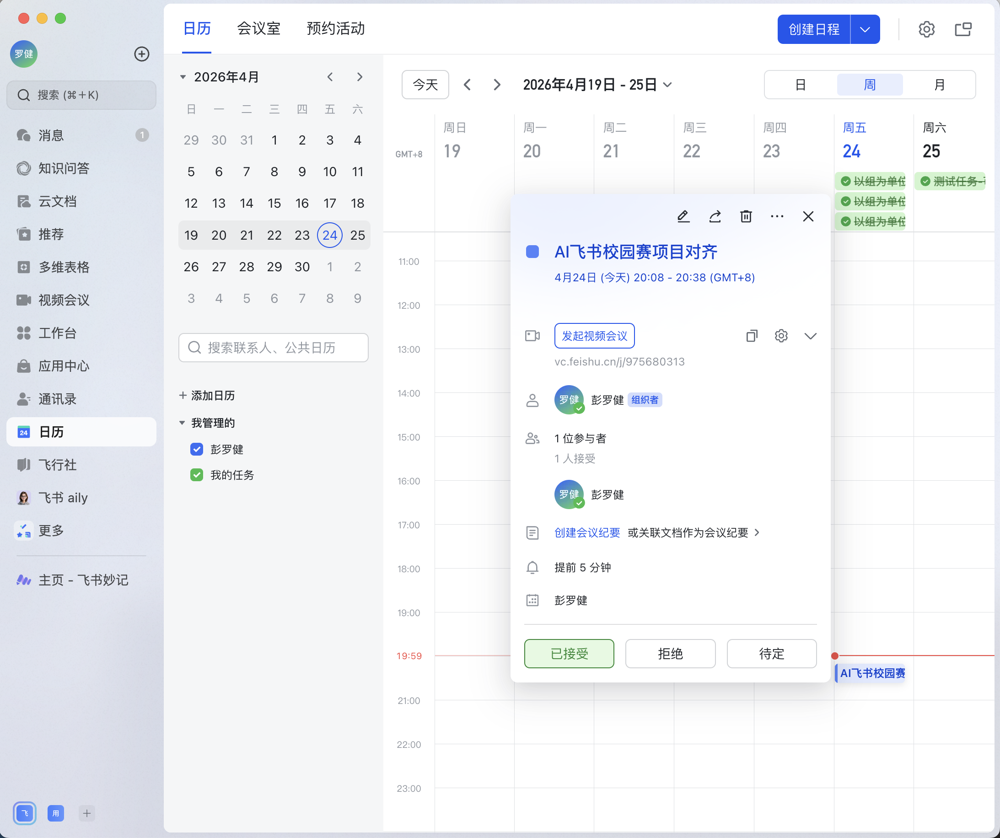

<div align="center">

[中文](#飞书会议助手) · [English](#feishu-meeting-assistant)

</div>

---

# 飞书会议助手

> 基于豆包大模型的飞书会议自动化助手，会前推送知识卡片，会后自动生成 Action Items 并创建飞书任务。

<div align="center">

**飞书 AI 校园挑战赛 · OpenClaw 赛道参赛项目**

</div>

## 功能演示

### 会前：自动检测日历并推送知识卡片

会议开始前 10 分钟，系统自动检测飞书日历，提取会议主题关键词，搜索知识库并通过 LLM 重排，将最相关的参考文档以交互卡片形式推送给所有参会人。




### 服务运行日志

服务每 60 秒轮询日历，自动触发关键词提取 → Wiki 搜索 → LLM 重排 → 卡片推送全流程。


### 会后：自动生成任务并分配责任人

会议结束后，系统监听 `vc.meeting.end` 事件，自动拉取会议转写，提取 Action Items 并创建飞书任务，自动识别责任人、设置截止时间，并关联相关知识文档。


### 会后：任务详情（责任人 + 截止时间 + 知识文档）

每条任务包含：来自会议的背景说明、责任人、截止日期，以及自动关联的相关知识库文档链接。


## 技术架构

```
工作流 1 · 会前推送
飞书日历（APScheduler 轮询）
  → LLM 关键词提取
  → 飞书 Wiki 搜索（召回候选）
  → LLM 重排（按会议语义排序）
  → 飞书交互卡片推送给参会人

工作流 2 · 会后处理
飞书 vc.meeting.end 事件（WebSocket 监听）
  → 拉取会议转写 / 妙记
  → LLM 提取 Action Items（结构化 JSON）
  → Wiki 关联（每条 Action Item 匹配相关文档）
  → 自动创建飞书任务并分配给执行人
```

## 技术栈

| 组件 | 技术 |
|------|------|
| LLM | 豆包 1.6（Volcengine Ark，OpenAI 兼容接口）|
| 飞书能力 | lark-cli（日历 / IM / Wiki / 任务 / 视频会议）|
| 服务框架 | FastAPI + APScheduler |
| 运行环境 | Python 3.11+，uvicorn |

## 快速开始

**1. 安装依赖**
```bash
pip install -e .
```

**2. 配置环境变量**
```bash
cp .env.example .env
# 编辑 .env，填入以下必填项：
# DOUBAO_API_KEY=your_api_key
# LLM_MODEL=your_endpoint_id
# WIKI_SPACE_ID=your_wiki_space_id
```

**3. 启动服务**
```bash
uvicorn app.main:app --port 8080
```

**4. 调试端点**
```bash
# 手动触发会前推送（测试 LLM 关键词提取 + Wiki 搜索 + 卡片推送）
curl -X POST http://localhost:8080/debug/trigger-premeet \
  -H "Content-Type: application/json" \
  -d '{"event_id":"test-001","title":"会议标题","description":"议程描述","attendee_open_ids":["ou_xxx"]}'

# 手动触发会后流程（dry_run=true 仅查看结果，不实际建任务）
curl -X POST http://localhost:8080/debug/trigger-postmeet \
  -H "Content-Type: application/json" \
  -d '{"meeting_id":"your_meeting_id","dry_run":true}'
```

---

# Feishu Meeting Assistant

> An automated Feishu meeting assistant powered by Doubao LLM. Pushes pre-meeting knowledge cards and automatically generates Action Items with Feishu tasks after meetings.

<div align="center">

**Feishu AI Campus Challenge · OpenClaw Track**

</div>

## Demo

### Pre-meeting: Auto-detect Calendar & Push Knowledge Cards

10 minutes before a meeting starts, the system automatically detects Feishu calendar events, extracts keywords from the meeting topic, searches the knowledge base, reranks results with LLM, and pushes the most relevant documents as an interactive card to all attendees.


### Service Logs

The service polls the calendar every 60 seconds and automatically triggers the full pipeline: keyword extraction → Wiki search → LLM reranking → card push.


### Post-meeting: Auto-create Tasks with Assigned Owners

After the meeting ends, the system listens for the `vc.meeting.end` event, fetches the transcript, extracts Action Items, and creates Feishu tasks — automatically identifying owners, setting due dates, and linking relevant wiki documents.


### Post-meeting: Task Detail (Owner + Due Date + Wiki Links)

Each task includes meeting context, assignee, due date, and automatically linked knowledge base documents.


## Architecture

```
Workflow 1 · Pre-meeting Push
Feishu Calendar (APScheduler polling)
  → LLM keyword extraction
  → Feishu Wiki search (candidate retrieval)
  → LLM reranking (semantic relevance to meeting)
  → Push interactive card to all attendees

Workflow 2 · Post-meeting Processing
Feishu vc.meeting.end event (WebSocket listener)
  → Fetch meeting transcript / minutes
  → LLM Action Item extraction (structured JSON)
  → Wiki linking (match relevant docs per Action Item)
  → Auto-create Feishu tasks assigned to owners
```

## Tech Stack

| Component | Technology |
|-----------|-----------|
| LLM | Doubao 1.6 (Volcengine Ark, OpenAI-compatible) |
| Feishu APIs | lark-cli (Calendar / IM / Wiki / Task / VC) |
| Service | FastAPI + APScheduler |
| Runtime | Python 3.11+, uvicorn |

## Quick Start

**1. Install dependencies**
```bash
pip install -e .
```

**2. Configure environment**
```bash
cp .env.example .env
# Edit .env and fill in the required fields:
# DOUBAO_API_KEY=your_api_key
# LLM_MODEL=your_endpoint_id
# WIKI_SPACE_ID=your_wiki_space_id
```

**3. Start the service**
```bash
uvicorn app.main:app --port 8080
```

**4. Debug endpoints**
```bash
# Manually trigger pre-meeting push (test keyword extraction + Wiki search + card push)
curl -X POST http://localhost:8080/debug/trigger-premeet \
  -H "Content-Type: application/json" \
  -d '{"event_id":"test-001","title":"Meeting Title","description":"Agenda","attendee_open_ids":["ou_xxx"]}'

# Manually trigger post-meeting pipeline (dry_run=true shows results without creating tasks)
curl -X POST http://localhost:8080/debug/trigger-postmeet \
  -H "Content-Type: application/json" \
  -d '{"meeting_id":"your_meeting_id","dry_run":true}'
```
