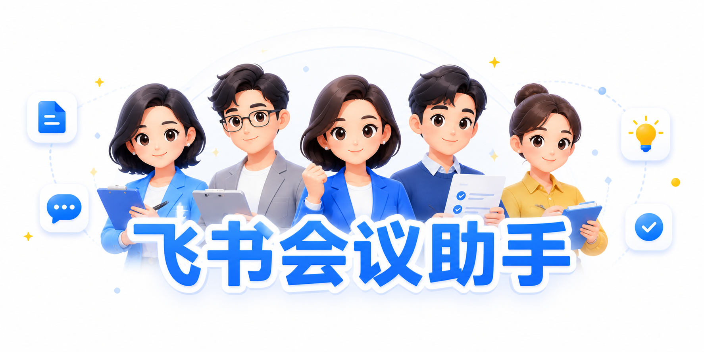
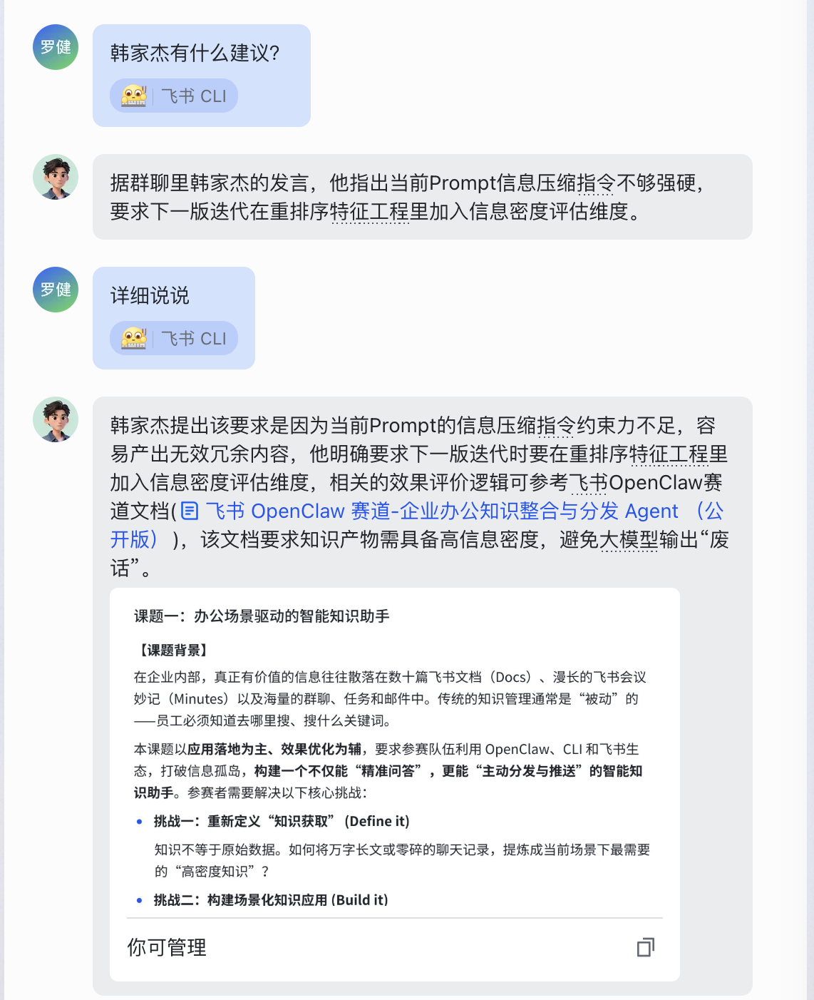
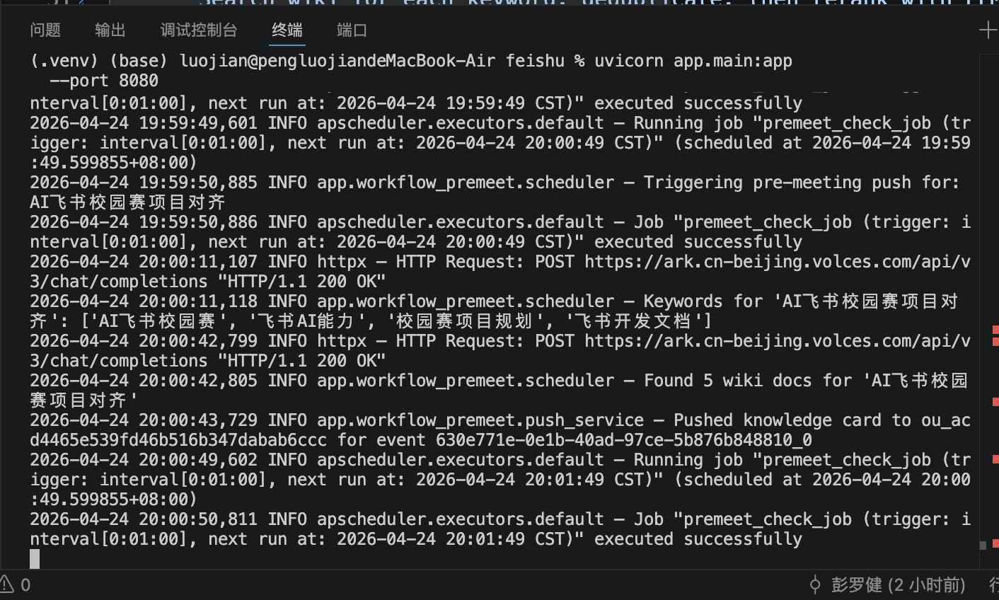
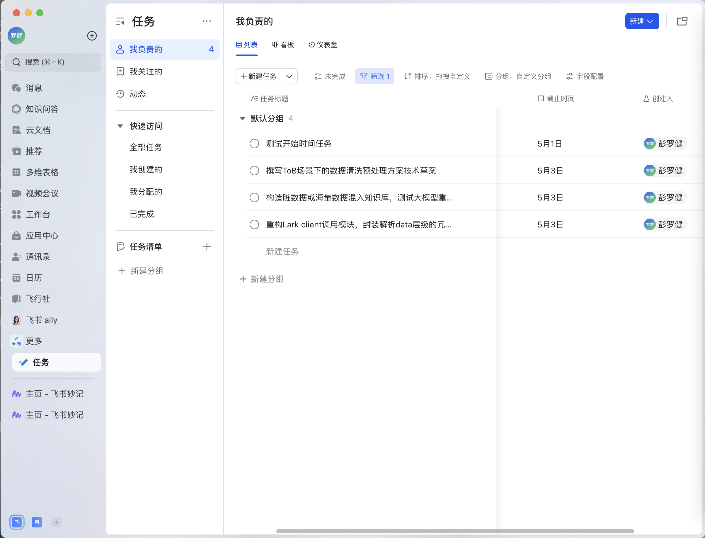
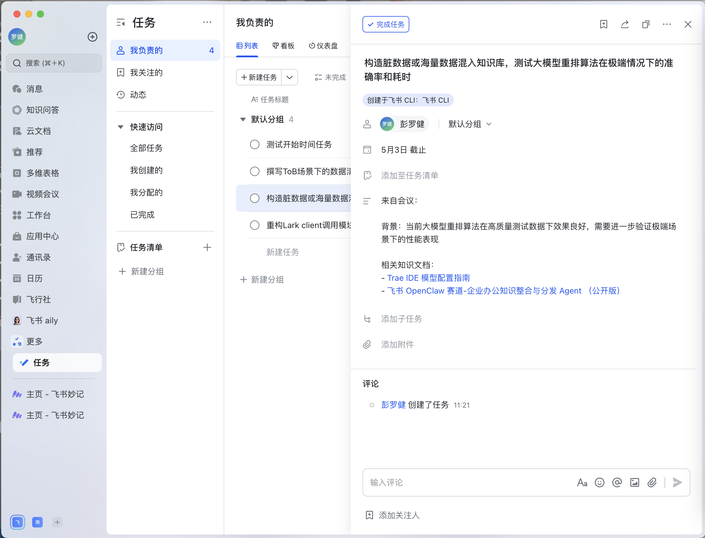

<h1 align="center">飞书会议助手</h1>

<p align="center">
  <strong>基于豆包大模型的飞书会议全流程自动化助手</strong><br/>
  会前融合聊天与知识库推送「会前同步卡」· 会中 Q&A 实时追问 · 会后自动生成任务
</p>

<p align="center">
  <a href="#飞书会议助手">中文</a> &nbsp;·&nbsp; <a href="#feishu-meeting-assistant">English</a>
</p>

<p align="center">
  
  &nbsp;
  
  &nbsp;
  
  &nbsp;
  
  &nbsp;
  
</p>

<p align="center">
  
</p>

---

## ✨ 核心功能

- **会前同步卡**：会议前 25 分钟自动推送，并发融合私聊 DM + 群聊上下文 + 知识库文档，经混合召回（全文 + 向量双路）与 LLM 两步提炼，生成结构化会前简报
- **会中 Q&A**：机器人私聊中实时追问，章节级文档检索 + 多轮对话记忆 + 代词查询增强，自然汇报风格回答，来源可追溯
- **会后任务**：监听 `vc.meeting.end` 事件，自动提取 Action Items，识别责任人、设置截止时间、关联知识文档并创建飞书任务

---

## 📸 功能演示

### 会前：「会前同步卡」推送

会议开始前 25 分钟，系统自动检测飞书日历，**并发融合四路信息**，经 LLM 两步提炼后推送给所有参会人。

**四路信息融合**：
1. 会议基础信息（标题 / 议程 / 参会人 / 发起人）
2. 与所有参会人的私聊 DM（近 14 天；外部/b2c 用户自动 fallback 到消息搜索）
3. 会议绑定群聊上下文（优先读取日历 API `chat_id`，无绑定时按关键词搜索，近 7 天）
4. 知识库文档（混合召回 → 质量过滤 → 版本去重 → LLM 语义精排 → 文档富化 → LLM 内容去重）

**卡片三段式结构**：
- **最近上下文**：LLM 两步提炼——先选 3-5 句最相关原句，再改写为 40-50 字自然句，附 📅 溯源标签
- **关键材料**：top 3 相关文档，含 📄 相关说明 + 📌 关键结论
- **待确认问题**：LLM 从上下文提炼 1-3 条需在会中解决的问题


### Q&A 会议助手追问：

收到「会前同步卡」后，可在机器人私聊中直接追问会议相关问题。

**核心机制**：
- **章节级精准检索**：按多格式标题切分章节，关键词打分（标题命中 3× + 正文命中），首节强制保留，贪心填充至 3000 字
- **多轮对话记忆**：history MAX 10 轮，LLM 注入最近 3 轮 + 会议身份前缀
- **代词查询增强**：检测含代词（这/该/它）时追加上一轮关键词扩充检索，修复「设置这个机制原因」类 0 命中
- **来源可追溯**：文档附链接，私聊注明联系人，群聊注明群名
- **自然汇报风格**：先结论 → 来源内联 → 收口，150 字以内，禁 Markdown 符号



### 服务运行日志

服务每 60 秒轮询日历，自动触发完整处理流程。



### 会后：自动生成任务并分配责任人



### 会后：任务详情（责任人 + 截止时间 + 知识文档）



---

## 🛠️ 技术栈

<div align="center">
  
  &nbsp;
  
  &nbsp;
  
  &nbsp;
  
  &nbsp;
  
</div>

<br/>

| 组件 | 技术 |
|------|------|
| LLM | 豆包 2.0（Volcengine Ark，OpenAI 兼容接口）|
| Embedding | Doubao-Embedding-Vision（2048 维，httpx 并发调用，独立 API Key）|
| 向量索引 | 纯 Python cosine（struct pack/unpack）+ SQLite BLOB 持久化，max-pool 多 chunk 聚合 |
| 持久化 | SQLite（pushed_events / qa_context / doc_index / doc_embeddings 四表）|
| 飞书能力 | lark-cli（日历 / IM / Wiki / 任务 / 视频会议）|
| 服务框架 | FastAPI + APScheduler |
| 运行环境 | Python 3.11+，uvicorn |

---

## ⚙️ 系统架构

<details>
<summary><b>点击展开查看完整架构图</b></summary>

```
工作流 1 · 会前推送
飞书日历（APScheduler 轮询，会议前 25 分钟触发）
  → 并发四路信息融合
      ├─ 私聊 DM（与所有参会人，近 14 天）
      ├─ 会议群聊上下文（近 7 天）
      └─ 知识库文档
            → LLM 关键词提取
            → 混合召回（并行双路）
                ├─ 全文路：docs +search（LLM 关键词 + 标题滑窗兜底）
                └─ 向量路：Doubao-Embedding-Vision 离线索引（90天内文档预分块嵌入，
                           docx 800/100、slides 500/50、sheet 300/0，带标题前缀）
                           → embed_query 实时向量化 → max-pool 余弦召回 top-5 补充
            → Layer 1 质量过滤（时效 / 类型 / owner / 标题，阈值 0.3）
            → 版本去重（正则识别 v1/v2、第一版/第二版、①②、1️⃣2️⃣ 等，保留最高版本）
            → LLM 语义精排（0-10 分）
            → LLM 内容去重（跨知识库相同内容只留最新版）
            → 文档正文富化（关键结论 / 待确认问题）
  → LLM 两步上下文提炼（SELECT 关键句 → SYNTHESIZE 自然句 + 溯源标签）
  → 会前同步卡推送给参会人

工作流 2 · 会中 Q&A
用户在机器人私聊发送问题（im.message 事件监听）
  → 从 context_store 读取会前简报（TTL 4 小时）
  → 代词检测 → 追加上一轮关键词扩充 query（如需）
  → 实时 wiki 搜索（增强 query）
       → 章节级精准提取（按标题切分 → 关键词打分 title×3 + body → 强制首节 → 贪心填充 ≤ 3000 字）
       → 兜底：若实时搜索无结果，富化简报中 key_docs
  → 注入最近 3 轮 history + 会议身份前缀
  → LLM 生成自然语言回答（先结论 → 来源内联 → 收口，≤ 150 字）
  → 写入 history（MAX 10 轮）

工作流 3 · 会后处理
飞书 vc.meeting.end 事件（WebSocket 监听）
  → 拉取会议转写 / 妙记
  → LLM 提取 Action Items（结构化 JSON）
  → Wiki 关联（每条 Action Item 匹配相关文档）
  → 自动创建飞书任务并分配给执行人
```

</details>

---

## 🚀 快速开始

**1. 安装依赖**
```bash
pip install -e .
```

**2. 配置环境变量**
```bash
cp .env.example .env
# 编辑 .env，填入以下必填项：
# DOUBAO_API_KEY=your_api_key
# LLM_MODEL=your_endpoint_id
# DOUBAO_EMBEDDING_MODEL=your_embedding_endpoint_id
# WIKI_SPACE_ID=your_wiki_space_id
# MY_OPEN_ID=your_own_open_id   # 排除自身，避免 DM 误查自己
```

**3. 启动服务**
```bash
uvicorn app.main:app --port 8080
```

**4. 构建向量索引**
```bash
curl -X POST http://localhost:8080/admin/rebuild-index
```

**5. 调试端点**
```bash
# 手动触发会前推送
curl -X POST http://localhost:8080/debug/trigger-premeet \
  -H "Content-Type: application/json" \
  -d '{"event_id":"test-001","title":"会议标题","description":"议程描述","attendee_open_ids":["ou_xxx"]}'

# 手动触发会后流程（dry_run=true 仅查看结果，不实际建任务）
curl -X POST http://localhost:8080/debug/trigger-postmeet \
  -H "Content-Type: application/json" \
  -d '{"meeting_id":"your_meeting_id","dry_run":true}'
```

---

<div align="center">

**[⬆ 回到顶部](#飞书会议助手)**

</div>

---
---

<h1 align="center">Feishu Meeting Assistant</h1>

<p align="center">
  <strong>An automated Feishu meeting assistant powered by Doubao LLM</strong><br/>
  Pre-meeting briefing card · In-meeting Q&A · Post-meeting task creation
</p>

<p align="center">
  <a href="#飞书会议助手">中文</a> &nbsp;·&nbsp; <a href="#feishu-meeting-assistant">English</a>
</p>

<p align="center">
  
  &nbsp;
  
  &nbsp;
  
  &nbsp;
  
  &nbsp;
  
</p>

<p align="center">
  
</p>

---

## ✨ Key Features

- **Pre-meeting Briefing Card**: Automatically pushed 25 min before the meeting. Concurrently fuses DM history, group chat context, and knowledge base docs via hybrid recall (full-text + vector), then synthesizes a structured briefing card via two-step LLM
- **In-meeting Q&A**: Real-time follow-up in bot DM. Section-level document retrieval, multi-turn memory, pronoun query expansion, and natural-language replies with inline source attribution
- **Post-meeting Tasks**: Listens for `vc.meeting.end`, extracts Action Items, assigns owners, sets due dates, links wiki docs, and creates Feishu tasks automatically

---

## 📸 Demo

### Pre-meeting: "Meeting Briefing Card" Push

25 minutes before a meeting, the system detects the calendar event and **concurrently fuses four information sources**.

**Four information sources (concurrent)**:
1. Meeting basics (title / agenda / attendees / organizer)
2. DM history with all attendees (last 14 days; external/b2c users fall back to message search)
3. Bound group chat context (reads `chat_id` from calendar API or discovers via keyword search; last 7 days)
4. Knowledge base docs (hybrid recall → quality filter → version dedup → LLM semantic reranking → enrichment → LLM content dedup)

**Three-section card structure**:
- **Recent Context**: Two-step LLM synthesis — select 3-5 key sentences, rewrite as 40-50 char natural bullets with 📅 source labels
- **Key Materials**: Top 3 relevant docs with 📄 relevance note + 📌 key conclusion
- **Open Questions**: 1-3 unresolved points LLM extracted from context

### In-meeting: Q&A Follow-up Assistant

After receiving the briefing card, attendees can ask follow-up questions directly in the bot's DM chat.

**How it works**:
- **Section-level retrieval**: Splits docs by heading, scores each section (title hit ×3 + body), forces first section, greedy fill up to 3,000 chars
- **Multi-turn memory**: History MAX 10 turns; LLM receives last 3 turns + meeting identity prefix
- **Pronoun query expansion**: Detects pronouns (这/该/它) and appends discriminative terms from the previous turn — fixing zero-hit cases like "why was this mechanism introduced?"
- **Traceable sources**: Docs include clickable links; DM sources name the contact; group sources name the group
- **Natural reporting style**: Conclusion → inline attribution → closing remark, ≤ 150 chars, no Markdown symbols


### Service Logs

The service polls the calendar every 60 seconds and triggers the full pipeline automatically.


### Post-meeting: Auto-create Tasks with Assigned Owners


### Post-meeting: Task Detail (Owner + Due Date + Wiki Links)


---

## 🛠️ Tech Stack

<div align="center">
  
  &nbsp;
  
  &nbsp;
  
  &nbsp;
  
  &nbsp;
  
</div>

<br/>

| Component | Technology |
|-----------|-----------|
| LLM | Doubao 2.0 (Volcengine Ark, OpenAI-compatible) |
| Embedding | Doubao-Embedding-Vision (2048-dim, concurrent httpx calls, separate API key) |
| Vector index | Pure-Python cosine (struct pack/unpack) + SQLite BLOB persistence, max-pool multi-chunk aggregation |
| Persistence | SQLite (pushed_events / qa_context / doc_index / doc_embeddings) |
| Feishu APIs | lark-cli (Calendar / IM / Wiki / Task / VC) |
| Service | FastAPI + APScheduler |
| Runtime | Python 3.11+, uvicorn |

---

## ⚙️ Architecture

<details>
<summary><b>Click to expand full architecture diagram</b></summary>

```
Workflow 1 · Pre-meeting Push
Feishu Calendar (APScheduler polling, triggers 25 min before meeting)
  → Concurrent 4-source fusion
      ├─ DM history with all attendees (last 14 days)
      ├─ Meeting group chat context (last 7 days)
      └─ Knowledge base docs
            → LLM keyword extraction
            → Hybrid recall (two paths in parallel)
                ├─ Full-text path: docs +search (LLM keywords + sliding-window title fallback)
                └─ Vector path: Doubao-Embedding-Vision offline index (docs updated within 90 days,
                                pre-chunked with title prefix — docx 800/100, slides 500/50, sheet 300/0)
                                → embed_query at query time → max-pool cosine, top-5 extra docs
            → Layer 1 quality filter (recency / type / owner / title, threshold 0.3)
            → Version dedup (regex strips v1/v2, 第一版/第二版, ①②, 1️⃣2️⃣ etc.; keeps highest version)
            → LLM semantic reranking (0-10 score)
            → LLM content dedup (keep newest copy across knowledge spaces)
            → Document enrichment (conclusions / open questions)
  → Two-step LLM context synthesis (SELECT key sentences → SYNTHESIZE natural bullets + source labels)
  → Push briefing card to all attendees

Workflow 2 · In-meeting Q&A
User sends a question in bot DM (im.message event listener)
  → Load pre-meeting brief from context_store (TTL 4h)
  → Pronoun detection → augment search query with terms from previous turn (if needed)
  → Real-time wiki search (augmented query)
       → Section-level extraction (split by heading → keyword scoring title×3 + body → force first section → greedy fill ≤ 3,000 chars)
       → Fallback: enrich key_docs from brief if live search returns nothing
  → Inject last 3 conversation turns + meeting identity prefix
  → LLM generates natural-language reply (conclusion → inline sources → closing, ≤ 150 chars)
  → Append turn to history (MAX 10 turns)

Workflow 3 · Post-meeting Processing
Feishu vc.meeting.end event (WebSocket listener)
  → Fetch meeting transcript / minutes
  → LLM Action Item extraction (structured JSON)
  → Wiki linking (match relevant docs per Action Item)
  → Auto-create Feishu tasks assigned to owners
```

</details>

---

## 🚀 Quick Start

**1. Install dependencies**
```bash
pip install -e .
```

**2. Configure environment**
```bash
cp .env.example .env
# Edit .env and fill in the required fields:
# DOUBAO_API_KEY=your_api_key
# LLM_MODEL=your_endpoint_id
# DOUBAO_EMBEDDING_MODEL=your_embedding_endpoint_id
# WIKI_SPACE_ID=your_wiki_space_id
# MY_OPEN_ID=your_own_open_id   # exclude yourself from DM targets
```

**3. Start the service**
```bash
uvicorn app.main:app --port 8080
```

**4. Build vector index**
```bash
curl -X POST http://localhost:8080/admin/rebuild-index
```

**5. Debug endpoints**
```bash
# Manually trigger pre-meeting push
curl -X POST http://localhost:8080/debug/trigger-premeet \
  -H "Content-Type: application/json" \
  -d '{"event_id":"test-001","title":"Meeting Title","description":"Agenda","attendee_open_ids":["ou_xxx"]}'

# Manually trigger post-meeting pipeline (dry_run=true shows results without creating tasks)
curl -X POST http://localhost:8080/debug/trigger-postmeet \
  -H "Content-Type: application/json" \
  -d '{"meeting_id":"your_meeting_id","dry_run":true}'
```

---

<div align="center">

**[⬆ Back to top](#feishu-meeting-assistant)**

</div>
