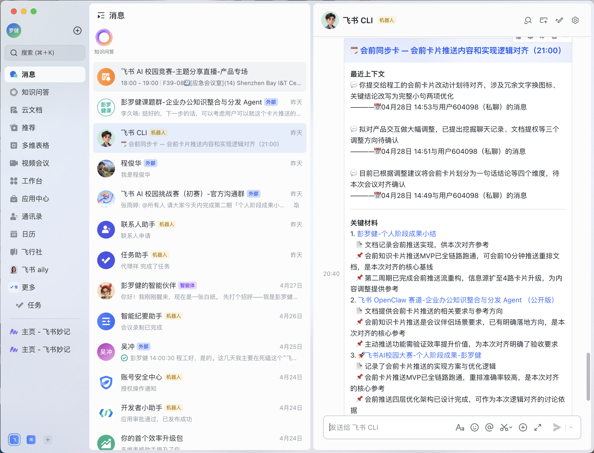

<div align="center">

[中文](#飞书会议助手) · [English](#feishu-meeting-assistant)

</div>

---

# 飞书会议助手

> 基于豆包大模型的飞书会议自动化助手，会前融合聊天记录与知识库推送「会前同步卡」，会后自动生成 Action Items 并创建飞书任务。

<div align="center">

**飞书 AI 校园挑战赛 · OpenClaw 赛道参赛项目**

</div>

## 功能演示

### 会前：「会前同步卡」推送

会议开始前 25 分钟，系统自动检测飞书日历，**并发融合四路信息**，经 LLM 两步提炼后生成「会前同步卡」推送给所有参会人。

**四路信息融合**：
1. 会议基础信息（标题 / 议程 / 参会人 / 发起人）
2. 当前用户与所有参会人的私聊 DM（近 14 天，最新 10 条；外部/b2c 用户自动 fallback 到消息搜索）
3. 会议绑定群聊的上下文（优先读取日历 API `chat_id` 字段及 applink `openId=oc_xxx`，无绑定时按关键词搜索最相关群，近 7 天）
4. 知识库文档（质量过滤 → 版本去重保留最新版 → LLM 语义精排 → 文档富化 → LLM 内容去重）

**卡片三段式结构**：
- **最近上下文**：LLM 两步提炼——先从原始消息中选 3-5 句最相关原句，再改写成 40-50 字自然句（含主体 + 进展），每条附 📅 溯源标签（时间 + 来源对话/群聊）
- **关键材料**：top 3 相关文档，含 📄 相关说明 + 📌 关键结论
- **待确认问题**：LLM 从上下文中提炼 1-3 条需在会中解决的问题



### 会中：Q&A 会议助手追问

收到「会前同步卡」后，可在机器人私聊中直接追问会议相关问题。助手会实时从知识库检索相关文档，结合近期私聊/群聊记录给出回答，并内联注明来源（文档附链接，私聊说联系人）。

**核心机制**：
- **章节级精准检索**：对文档按多格式标题（`##`/`一、`/`1.`/`（一）`）切分章节，提取问题关键词（英文整词 + 中文 2/3/4-gram，过滤高频泛化词），对每个章节按标题命中 3× 权重 + 正文命中打分，首节强制保留（背景信息），贪心填充至 3000 字上限，避免长文档位置截断丢失关键章节
- **多轮对话记忆**：每轮问答写入 history（MAX 10 轮），LLM 注入最近 3 轮 + 会议身份前缀，回答自然衔接，不重复解释已说过内容
- **代词查询增强**：检测问题含代词（这/该/它），自动从上一轮问题提取最有判别力的词扩充检索 query，修复「设置这个机制的原因」类 0 命中问题，LLM 仍收到原始问题
- **来源可追溯**：文档来源自动附链接，私聊来源注明联系人姓名，群聊来源注明群名
- **自然汇报风格**：回答遵循「先结论→再来源→最后收口」的隐含顺序，150 字以内，禁用 Markdown 符号，来源内联不分区块


### 服务运行日志

服务每 60 秒轮询日历，自动触发关键词提取 → Wiki 搜索 → LLM 重排 → 文档富化 → 卡片推送全流程。


### 会后：自动生成任务并分配责任人

会议结束后，系统监听 `vc.meeting.end` 事件，自动拉取会议转写，提取 Action Items 并创建飞书任务，自动识别责任人、设置截止时间，并关联相关知识文档。


### 会后：任务详情（责任人 + 截止时间 + 知识文档）

每条任务包含：来自会议的背景说明、责任人、截止日期，以及自动关联的相关知识库文档链接。


## 技术架构

```
工作流 1 · 会前推送
飞书日历（APScheduler 轮询，会议前 25 分钟触发）
  → 并发四路信息融合
      ├─ 私聊 DM（与所有参会人，近 14 天）
      ├─ 会议群聊上下文（近 7 天）
      └─ 知识库文档
            → LLM 关键词提取
            → docs +search 全文搜索（含标题滑窗兜底）
            → 质量过滤（时效 / 类型 / 标题 / 发起人加成）
            → 版本去重（正则识别 v1/v2、第一版/第二版、①②、1️⃣2️⃣ 等，保留最高版本）
            → LLM 语义精排（0-10 分）
            → LLM 内容去重（跨知识库相同内容只留最新版）
            → 文档正文富化（关键结论 / 待确认问题）
  → LLM 两步上下文提炼（SELECT 关键句 → SYNTHESIZE 自然句 + 溯源标签）
  → 会前同步卡推送给参会人

工作流 2 · 会中 Q&A
用户在机器人私聊发送问题（im.message 事件监听）
  → 从 context_store 读取会前简报（TTL 4 小时）
  → 实时 wiki 搜索（用问题作为关键词）
       → 章节级精准提取（按标题切分 → 关键词打分 → top 章节 ≤ 3000 字）
  → 融合会前简报 + 实时检索内容
  → LLM 生成自然语言回答（先结论→来源内联→收口）

工作流 3 · 会后处理
飞书 vc.meeting.end 事件（WebSocket 监听）
  → 拉取会议转写 / 妙记
  → LLM 提取 Action Items（结构化 JSON）
  → Wiki 关联（每条 Action Item 匹配相关文档）
  → 自动创建飞书任务并分配给执行人
```

## 技术栈

| 组件 | 技术 |
|------|------|
| LLM | 豆包 2.0（Volcengine Ark，OpenAI 兼容接口）|
| 飞书能力 | lark-cli（日历 / IM / Wiki / 任务 / 视频会议）|
| 服务框架 | FastAPI + APScheduler |
| 运行环境 | Python 3.11+，uvicorn |

## 快速开始

**1. 安装依赖**
```bash
pip install -e .
```

**2. 配置环境变量**
```bash
cp .env.example .env
# 编辑 .env，填入以下必填项：
# DOUBAO_API_KEY=your_api_key
# LLM_MODEL=your_endpoint_id
# WIKI_SPACE_ID=your_wiki_space_id
# MY_OPEN_ID=your_own_open_id   # 排除自身，避免 DM 误查自己
```

**3. 启动服务**
```bash
uvicorn app.main:app --port 8080
```

**4. 调试端点**
```bash
# 手动触发会前推送（测试 LLM 关键词提取 + Wiki 搜索 + 卡片推送）
curl -X POST http://localhost:8080/debug/trigger-premeet \
  -H "Content-Type: application/json" \
  -d '{"event_id":"test-001","title":"会议标题","description":"议程描述","attendee_open_ids":["ou_xxx"]}'

# 手动触发会后流程（dry_run=true 仅查看结果，不实际建任务）
curl -X POST http://localhost:8080/debug/trigger-postmeet \
  -H "Content-Type: application/json" \
  -d '{"meeting_id":"your_meeting_id","dry_run":true}'
```

---

# Feishu Meeting Assistant

> An automated Feishu meeting assistant powered by Doubao LLM. Fuses chat context and knowledge base to push a pre-meeting briefing card, then auto-generates Action Items and Feishu tasks after meetings.

<div align="center">

**Feishu AI Campus Challenge · OpenClaw Track**

</div>

## Demo

### Pre-meeting: "Meeting Briefing Card" Push

25 minutes before a meeting, the system detects the calendar event and **concurrently fuses four information sources**, then uses a two-step LLM pipeline to generate and push a structured briefing card to all attendees.

**Four information sources (concurrent)**:
1. Meeting basics (title / agenda / attendees / organizer)
2. DM history with all attendees (last 14 days, top 10 messages; external/b2c users fall back to message search)
3. Bound group chat context (reads `chat_id` from calendar API or applink `openId=oc_xxx`; falls back to keyword-based group discovery when no link is present; last 7 days)
4. Knowledge base documents (quality filter → version dedup keeping latest → LLM semantic reranking → enrichment → LLM content dedup)

**Three-section card structure**:
- **Recent Context**: Two-step LLM synthesis — select 3-5 most relevant sentences from raw messages, then rewrite each into a 40-50 char natural sentence (subject + content + status), with a 📅 source label (timestamp + DM partner / group name)
- **Key Materials**: Top 3 relevant docs with 📄 relevance note + 📌 key conclusion
- **Open Questions**: 1-3 unresolved points LLM extracted from context


### In-meeting: Q&A Follow-up Assistant

After receiving the briefing card, attendees can ask follow-up questions directly in the bot's DM chat. The assistant performs real-time wiki search, combines knowledge base results with recent chat history, and replies with inline source attribution.

**How it works**:
- **Section-level retrieval**: Splits documents by heading (`##` / `一、` / `1.` / `（一）`), extracts discriminative terms from the question (whole English tokens + Chinese 2/3/4-gram, filtering generic stopwords), scores each section (title hit ×3 + body hit), forces the first section to always be included (background context), then greedily fills up to 3,000 chars — ensuring late sections are never silently dropped by positional truncation
- **Multi-turn memory**: Each Q&A turn is appended to a per-user history (MAX 10 turns); the LLM receives the last 3 turns plus a meeting identity prefix, enabling natural follow-up without repeating prior context
- **Pronoun query expansion**: Detects pronouns (这/该/它) in the question and appends the most discriminative terms from the previous turn to the retrieval query (LLM still sees the original question) — fixing zero-hit cases like "why was this mechanism introduced?"
- **Traceable sources**: Document sources include clickable links; DM sources name the contact; group chat sources name the group
- **Natural reporting style**: Answers follow an implicit order — conclusion first, then inline source attribution, then a closing remark — max 150 chars, no Markdown symbols


### Service Logs

The service polls the calendar every 60 seconds and triggers the full pipeline: keyword extraction → Wiki search → LLM reranking → document enrichment → card push.


### Post-meeting: Auto-create Tasks with Assigned Owners

After the meeting ends, the system listens for the `vc.meeting.end` event, fetches the transcript, extracts Action Items, and creates Feishu tasks — automatically identifying owners, setting due dates, and linking relevant wiki documents.


### Post-meeting: Task Detail (Owner + Due Date + Wiki Links)

Each task includes meeting context, assignee, due date, and automatically linked knowledge base documents.


## Architecture

```
Workflow 1 · Pre-meeting Push
Feishu Calendar (APScheduler polling, triggers 25 min before meeting)
  → Concurrent 4-source fusion
      ├─ DM history with all attendees (last 14 days)
      ├─ Meeting group chat context (last 7 days)
      └─ Knowledge base docs
            → LLM keyword extraction
            → docs +search full-text search (with sliding-window title fallback)
            → Quality filter (recency / type / title / organizer boost)
            → Version dedup (regex strips v1/v2, 第一版/第二版, ①②, 1️⃣2️⃣ etc.; keeps highest version)
            → LLM semantic reranking (0-10 score)
            → LLM content dedup (keep newest copy across knowledge spaces)
            → Document enrichment (conclusions / open questions)
  → Two-step LLM context synthesis (SELECT key sentences → SYNTHESIZE natural bullets + source labels)
  → Push briefing card to all attendees

Workflow 2 · In-meeting Q&A
User sends a question in bot DM (im.message event listener)
  → Load pre-meeting brief from context_store (TTL 4h)
  → Pronoun detection → augment search query with terms from previous turn (if needed)
  → Real-time wiki search (augmented query)
       → Section-level extraction (split by heading → keyword scoring title×3 + body → force first section → greedy fill ≤ 3,000 chars)
       → Fallback: enrich key_docs from brief if live search returns nothing
  → Inject last 3 conversation turns + meeting identity prefix
  → LLM generates natural-language reply (conclusion → inline sources → closing, ≤ 150 chars)
  → Append turn to history (MAX 10 turns)

Workflow 3 · Post-meeting Processing
Feishu vc.meeting.end event (WebSocket listener)
  → Fetch meeting transcript / minutes
  → LLM Action Item extraction (structured JSON)
  → Wiki linking (match relevant docs per Action Item)
  → Auto-create Feishu tasks assigned to owners
```

## Tech Stack

| Component | Technology |
|-----------|-----------|
| LLM | Doubao 2.0 (Volcengine Ark, OpenAI-compatible) |
| Feishu APIs | lark-cli (Calendar / IM / Wiki / Task / VC) |
| Service | FastAPI + APScheduler |
| Runtime | Python 3.11+, uvicorn |

## Quick Start

**1. Install dependencies**
```bash
pip install -e .
```

**2. Configure environment**
```bash
cp .env.example .env
# Edit .env and fill in the required fields:
# DOUBAO_API_KEY=your_api_key
# LLM_MODEL=your_endpoint_id
# WIKI_SPACE_ID=your_wiki_space_id
# MY_OPEN_ID=your_own_open_id   # exclude yourself from DM targets
```

**3. Start the service**
```bash
uvicorn app.main:app --port 8080
```

**4. Debug endpoints**
```bash
# Manually trigger pre-meeting push (test keyword extraction + Wiki search + card push)
curl -X POST http://localhost:8080/debug/trigger-premeet \
  -H "Content-Type: application/json" \
  -d '{"event_id":"test-001","title":"Meeting Title","description":"Agenda","attendee_open_ids":["ou_xxx"]}'

# Manually trigger post-meeting pipeline (dry_run=true shows results without creating tasks)
curl -X POST http://localhost:8080/debug/trigger-postmeet \
  -H "Content-Type: application/json" \
  -d '{"meeting_id":"your_meeting_id","dry_run":true}'
```
